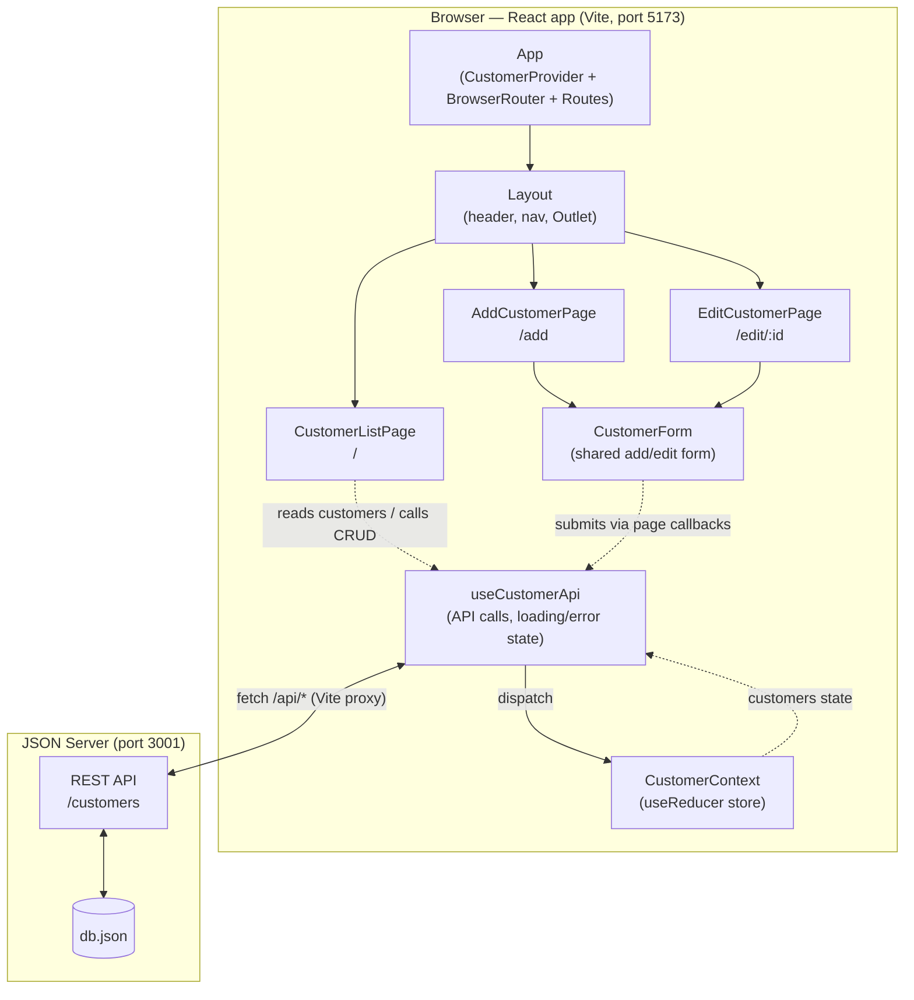
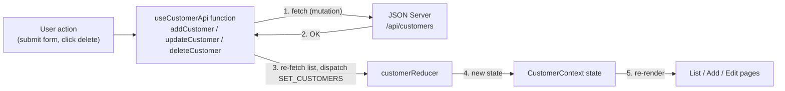
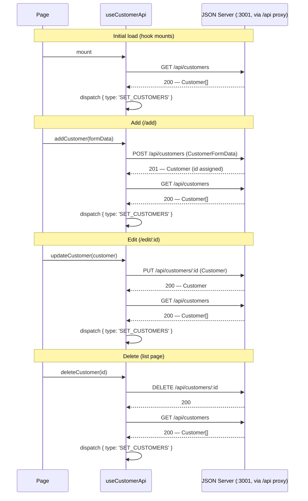

# Architecture

Design decisions for the Customer Manager app. For the component tree these
decisions apply to, see [DESIGN.md](./DESIGN.md).

## SYSTEM COMPONENTS



## CUSTOMER STATE DATA

Customer state lives in React context rather than being fetched independently
by each page: `CustomerContext` holds the state and a typed `dispatch`,
`CustomerProvider` wraps the whole app in `App.tsx` (outside the router), and
components consume it through the `useCustomerContext` hook, which throws a
descriptive error if used outside the provider. The list, add, and edit pages
all read from and update the same source of truth.

## CRUD OPERATIONS

With `useReducer` and typed actions for scalability. A single
`customerReducer` handles the customer collection, with a discriminated-union
action type (`src/context/CustomerContext.ts`):

```ts
export type CustomerAction =
  | { type: 'ADD_CUSTOMER'; payload: Customer }
  | { type: 'UPDATE_CUSTOMER'; payload: Customer }
  | { type: 'DELETE_CUSTOMER'; payload: number }
  | { type: 'SET_CUSTOMERS'; payload: Customer[] }
```

Each CRUD operation calls the JSON Server API first, then re-fetches the full
list and dispatches `SET_CUSTOMERS` with the server's response, so local state
always reflects exactly what the server persisted (including server-assigned
ids). The granular `ADD_CUSTOMER` / `UPDATE_CUSTOMER` / `DELETE_CUSTOMER`
actions are also handled by the reducer for local-only updates. Typed actions
make every state transition explicit and give the compiler a way to catch
missing or malformed updates as the app grows.

### Data flow

Every mutation follows the same loop — API first, then dispatch, then
re-render:



### API calls

All requests go through the Vite dev-server proxy: the app fetches
`/api/customers`, which is forwarded to JSON Server on port 3001 with the
`/api` prefix stripped. After every mutation the hook re-fetches the list and
dispatches `SET_CUSTOMERS`.



## CUSTOM HOOKS

- `useCustomerApi` (`src/hooks/useCustomerApi.ts`) — wraps all API calls.
  Fetches the customer list on mount, exposes `customers` (from context) along
  with async `addCustomer`, `updateCustomer`, and `deleteCustomer` functions,
  and tracks `loading` and `error` state. Mutations resolve to a boolean so
  pages can navigate only on success. Pages call these functions instead of
  talking to the API directly.
- `useCustomerContext` (`src/context/useCustomerContext.ts`) — consumes
  `CustomerContext`, returning `{ state, dispatch }` and throwing a
  descriptive error when used outside `CustomerProvider`.

(Form field state and validation ended up living inside `CustomerForm` itself
with `useState`, rather than in the separate `useCustomerForm` hook originally
sketched here.)

## ADD/EDIT

One shared `CustomerForm` component is used by both pages, working with
`CustomerFormData` (the `Customer` type minus `id`, since JSON Server assigns
IDs). The mode is determined by its props:

- **Add** (`/add`): rendered with no `initialData`, so fields start empty and
  the submit button reads "Add Customer". Submitting calls `addCustomer`,
  which POSTs to the API.
- **Edit** (`/edit/:id`): the page looks up the customer by the `id` route
  param and passes it as `initialData`, so fields start pre-filled and the
  button reads "Update Customer". Submitting calls `updateCustomer` with the
  existing `id`, which PUTs to the API. If the id doesn't match any customer
  (after the initial fetch finishes), the page renders a "Customer not found."
  message with a link back to the list instead of the form.

The form itself never knows which mode it is in — it just receives initial
values and an `onSubmit` callback, and the page supplies the right behavior.

### Validation

The form validates on submit (`noValidate` disables native browser
validation). All fields are required; failing fields get a red border,
`aria-invalid`, and an inline error message that clears as soon as the field
is edited. Format rules:

| Field | Rule |
| --- | --- |
| Name | Two words separated by a space (first and last name) |
| Email | HTML5 email pattern, tightened to require a 2–63 letter TLD |
| Phone | 7 digits with a dash: `555-0101` |
| ZIP | 5-digit (`62704`) or 9-digit (`62704-1234` or `627041234`) |

API failures are separate from field validation: each page shows the hook's
`error` state in an `.error-banner`, and on failure the form keeps the user's
input instead of navigating away.

## TESTING

Component tests run with Vitest + React Testing Library in a jsdom
environment — no browser or JSON Server needed. Vitest is configured in
`vite.config.ts` (jsdom, globals, and a setup file at `src/test/setup.ts`
that registers the jest-dom matchers via `@testing-library/jest-dom/vitest`).
Tests are colocated with the components they cover.

Tests exercise components through their props and rendered output, not their
internals: callbacks are `vi.fn()` mocks, interactions go through
`userEvent`, and assertions query the DOM by role, label, or text.
`CustomerList` renders `<Link>`, so its tests wrap it in a `MemoryRouter`.

| Component | Covered behaviors |
| --- | --- |
| `CustomerList` | Renders all customer names; shows "No customers found." for an empty list; Delete calls `onDelete` with the clicked row's id; each Edit link points at `/edit/:id` |
| `CustomerForm` | Empty submit shows every required-field error and never calls `onSubmit`; valid input submits the exact `CustomerFormData`; Cancel calls `onCancel`; `initialData` pre-fills all fields and switches the button to "Update Customer" |

Run with `npm test` (watch) or `npm run test:run` (single pass).
