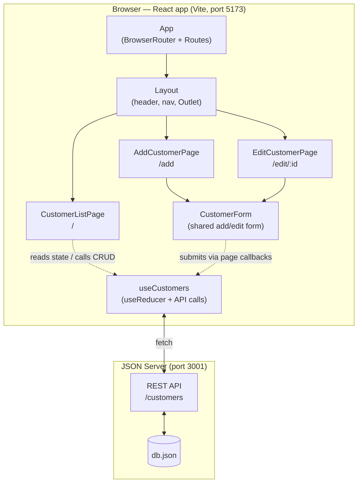
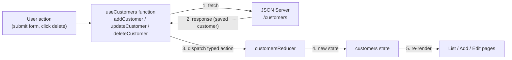
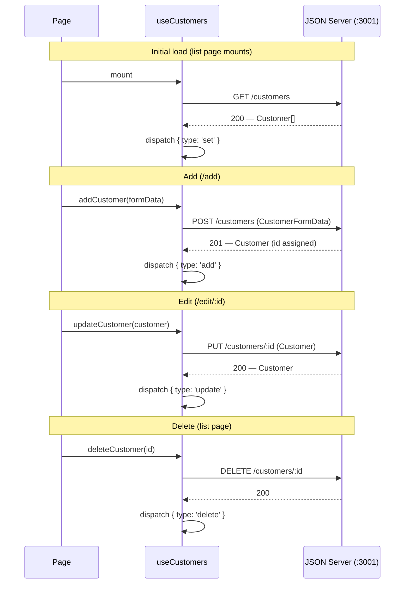

# Architecture

Design decisions for the Customer Manager app. For the component tree these
decisions apply to, see [DESIGN.md](./DESIGN.md).

## SYSTEM COMPONENTS



## CUSTOMER STATE DATA

Customer state is lifted to a shared parent component rather than fetched
independently by each page. The list, add, and edit pages all read from and
update the same source of truth, so changes made on one page (e.g. adding a
customer) are immediately reflected on the others without refetching.

## CRUD OPERATIONS

With `useReducer` and typed actions for scalability. A single reducer handles
the customer collection, with a discriminated-union action type such as:

```ts
type CustomerAction =
  | { type: 'set'; customers: Customer[] }   // initial load from the API
  | { type: 'add'; customer: Customer }
  | { type: 'update'; customer: Customer }
  | { type: 'delete'; id: number }
```

Each CRUD operation calls the JSON Server API first, then dispatches the
matching action with the server's response, keeping local state in sync with
`db.json`. Typed actions make every state transition explicit and give the
compiler a way to catch missing or malformed updates as the app grows.

### Data flow

Every mutation follows the same loop — API first, then dispatch, then
re-render:



### API calls



## CUSTOM HOOKS

- `useCustomers` — wraps the reducer and API calls. Owns the customer state
  and exposes it along with `addCustomer`, `updateCustomer`, and
  `deleteCustomer` functions, plus loading and error state. Pages call these
  functions instead of talking to the API directly.
- `useCustomerForm` — manages `CustomerFormData` field state, change handlers,
  and validation for the customer form, accepting optional initial values so
  the same hook serves both add and edit modes.

## ADD/EDIT

One shared `CustomerForm` component is used by both pages, working with
`CustomerFormData` (the `Customer` type minus `id`, since JSON Server assigns
IDs). The mode is determined by its props:

- **Add** (`/add`): rendered with no initial values, so fields start empty.
  Submitting calls `addCustomer`, which POSTs to the API.
- **Edit** (`/edit/:id`): the page looks up the customer by the `id` route
  param and passes it as initial values, so fields start pre-filled.
  Submitting calls `updateCustomer` with the existing `id`, which PUTs to the
  API.

The form itself never knows which mode it is in — it just receives initial
values and an `onSubmit` callback, and the page supplies the right behavior.
