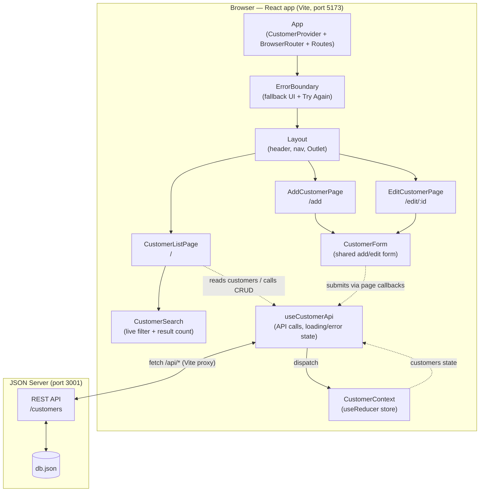
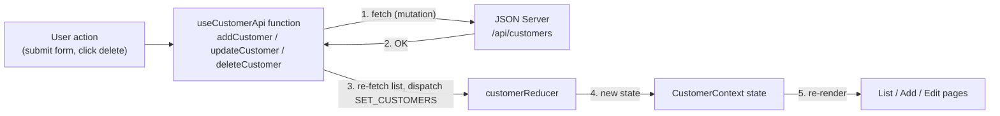
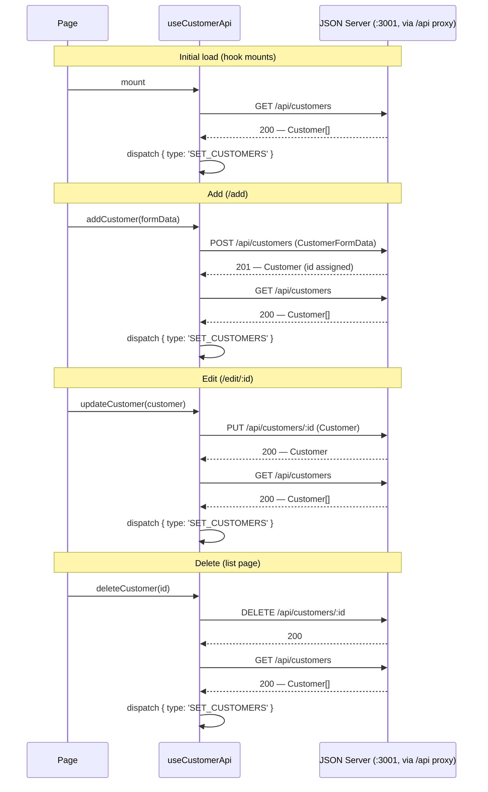

# Architecture

Design decisions for the Customer Manager app. For the component tree these
decisions apply to, see [DESIGN.md](./DESIGN.md).

## SYSTEM COMPONENTS



## CUSTOMER STATE DATA

Customer state lives in React context rather than being fetched independently
by each page: `CustomerContext` holds the state and a typed `dispatch`,
`CustomerProvider` wraps the whole app in `App.tsx` (outside the router), and
components consume it through the `useCustomerContext` hook, which throws a
descriptive error if used outside the provider. The list, add, and edit pages
all read from and update the same source of truth.

## CRUD OPERATIONS

With `useReducer` and typed actions for scalability. A single
`customerReducer` handles the customer collection, with a discriminated-union
action type (`src/context/CustomerContext.ts`):

```ts
export type CustomerAction =
  | { type: 'ADD_CUSTOMER'; payload: Customer }
  | { type: 'UPDATE_CUSTOMER'; payload: Customer }
  | { type: 'DELETE_CUSTOMER'; payload: number }
  | { type: 'SET_CUSTOMERS'; payload: Customer[] }
```

Each CRUD operation calls the JSON Server API first, then re-fetches the full
list and dispatches `SET_CUSTOMERS` with the server's response, so local state
always reflects exactly what the server persisted (including server-assigned
ids). The granular `ADD_CUSTOMER` / `UPDATE_CUSTOMER` / `DELETE_CUSTOMER`
actions are also handled by the reducer for local-only updates. Typed actions
make every state transition explicit and give the compiler a way to catch
missing or malformed updates as the app grows.

### Data flow

Every mutation follows the same loop — API first, then dispatch, then
re-render:



### API calls

All requests go through the Vite dev-server proxy: the app fetches
`/api/customers`, which is forwarded to JSON Server on port 3001 with the
`/api` prefix stripped. After every mutation the hook re-fetches the list and
dispatches `SET_CUSTOMERS`.



## CUSTOM HOOKS

- `useCustomerApi` (`src/hooks/useCustomerApi.ts`) — wraps all API calls.
  Fetches the customer list on mount, exposes `customers` (from context) along
  with async `addCustomer`, `updateCustomer`, and `deleteCustomer` functions,
  and tracks `loading` and `error` state. Mutations resolve to a boolean so
  pages can navigate only on success. Pages call these functions instead of
  talking to the API directly.
- `useCustomerContext` (`src/context/useCustomerContext.ts`) — consumes
  `CustomerContext`, returning `{ state, dispatch }` and throwing a
  descriptive error when used outside `CustomerProvider`.
- `useTheme` (`src/hooks/useTheme.ts`) — owns the light/dark theme state,
  stamps `data-theme` onto `<html>`, and persists explicit toggles to
  `localStorage` (see THEMING below).

(Form field state and validation ended up living inside `CustomerForm` itself
with `useState`, rather than in the separate `useCustomerForm` hook originally
sketched here.)

## ADD/EDIT

One shared `CustomerForm` component is used by both pages, working with
`CustomerFormData` (the `Customer` type minus `id`, since JSON Server assigns
IDs). The mode is determined by its props:

- **Add** (`/add`): rendered with no `initialData`, so fields start empty and
  the submit button reads "Add Customer". Submitting calls `addCustomer`,
  which POSTs to the API.
- **Edit** (`/edit/:id`): the page looks up the customer by the `id` route
  param and passes it as `initialData`, so fields start pre-filled and the
  button reads "Update Customer". Submitting calls `updateCustomer` with the
  existing `id`, which PUTs to the API. If the id doesn't match any customer
  (after the initial fetch finishes), the page renders a "Customer not found."
  message with a link back to the list instead of the form.

The form itself never knows which mode it is in — it just receives initial
values and an `onSubmit` callback, and the page supplies the right behavior.

### Validation

The form validates on submit (`noValidate` disables native browser
validation). All fields are required; failing fields get a red border,
`aria-invalid`, and an inline error message that clears as soon as the field
is edited. Format rules:

| Field | Rule |
| --- | --- |
| Name | Two words separated by a space (first and last name) |
| Email | HTML5 email pattern, tightened to require a 2–63 letter TLD |
| Phone | 7 digits with a dash: `555-0101` |
| ZIP | 5-digit (`62704`) or 9-digit (`62704-1234` or `627041234`) |

API failures are separate from field validation: each page shows the hook's
`error` state in an `.error-banner` (with a bold "Error:" text prefix so
color isn't the only signal), and on failure the form keeps the user's input
instead of navigating away.

## LIST FILTERING & SORTING

Search and sort are client-side view state, derived on render and kept out
of the store — the context always holds the full server list:

```text
customers (context) → filterCustomers(query) → sortCustomers(sort) → table
```

- `filterCustomers` (`src/utils/filterCustomers.ts`) — case-insensitive
  substring match against name, email, or city; empty/whitespace queries
  return everything. `CustomerSearch` renders the input (with an × clear
  button and an `aria-live` "Showing X of Y customers" count) and reports
  keystrokes; `CustomerListPage` owns the query state.
- `sortCustomers` (`src/utils/sortCustomers.ts`) — locale-aware,
  case-insensitive sort by name, email, city, or state; `toggleSort`
  implements the click cycle (new column → ascending, same column → flip
  direction). The current sort is persisted to `sessionStorage`
  (`customer-list-sort`) and restored when the page remounts, so it
  survives navigating away and back; `loadSort` validates stored values and
  falls back to unsorted. `CustomerList` renders the header buttons and
  ▲/▼ + `aria-sort` indicators but stays stateless.

Both utils are pure functions, tested without any DOM.

## THEMING

Theme colors live as CSS custom properties in `index.css`, defined three
times: `:root` (light defaults), a `prefers-color-scheme: dark` media query
(OS preference / no-JS fallback), and `:root[data-theme='light'|'dark']`
overrides that win in both directions once set. Every component draws only
from the variables (`--bg`, `--text`, `--border`, `--accent`, `--danger`,
…), so the toggle restyles the table, form, nav, and error boundary with no
per-component work. The overrides also set `color-scheme`, flipping native
controls.

`useTheme` decides the initial theme (stored choice, else OS preference)
and applies `data-theme` to `<html>`; the Layout header renders the toggle
button. The preference is written to `localStorage` only on an explicit
toggle — users who never touch it keep following their OS setting.

## ERROR BOUNDARY

`ErrorBoundary` (`src/components/ErrorBoundary.tsx`) is a class component —
error boundaries require `getDerivedStateFromError` / `componentDidCatch`,
which have no function-component equivalent. It wraps `<Routes>` inside
`BrowserRouter` in `App.tsx`, so a render error in any page or the layout
shows a friendly fallback (heading, error message in a `<pre>`, and a
"Try Again" button that clears the error state and re-renders) instead of
unmounting the whole app. `CustomerProvider` sits above it, so customer
state survives the error. Caught errors and their component stacks are
logged to the console.

## ACCESSIBILITY

- Every form input has an explicit `<label htmlFor>` / `id` pair; invalid
  inputs set `aria-invalid` and `aria-describedby` pointing at their inline
  error message, so screen readers announce the error with the field.
- The customer table uses `<thead>` with `scope="col"` headers, and each
  row's actions have per-customer accessible names via `aria-label`
  ("Edit Maria Garcia", "Delete Maria Garcia").
- Delete is a destructive action, so it asks for confirmation
  (`window.confirm`) before calling the API.
- Sorted columns set `aria-sort` on the `<th>` alongside the visual ▲/▼
  indicator; the search result count is an `aria-live="polite"` region so
  filtering is announced as the user types.
- The dark mode toggle pairs its icon with visible text and an
  action-descriptive accessible name ("Switch to dark mode" /
  "Switch to light mode").
- Color is reinforced with text everywhere: red-bordered fields always have
  an error sentence, and error banners are `role="alert"` with a bold
  "Error:" prefix.

## DEPLOYMENT

`.github/workflows/deploy-docs.yml` builds the app and publishes a combined
site to GitHub Pages on every push to `main` touching `customer-app/`: the
Vite build at the site root (built with `--base "/<repo>/"`; the router gets
the matching `basename` from `import.meta.env.BASE_URL`), these docs under
`/docs/`, and a `404.html` copy of `index.html` as the SPA fallback for deep
links. Pages hosting is static — there is no JSON Server — so the deployed
app shows its error state instead of customer data; full CRUD requires
running locally with `npm run api`.

## TESTING

Component tests run with Vitest + React Testing Library in a jsdom
environment — no browser or JSON Server needed. Vitest is configured in
`vite.config.ts` (jsdom, globals, and a setup file at `src/test/setup.ts`
that registers the jest-dom matchers via `@testing-library/jest-dom/vitest`).
Tests are colocated with the components they cover.

Tests exercise components through their props and rendered output, not their
internals: callbacks are `vi.fn()` mocks, interactions go through
`userEvent`, and assertions query the DOM by role, label, or text.
`CustomerList` renders `<Link>`, so its tests wrap it in a `MemoryRouter`.

| Component | Covered behaviors |
| --- | --- |
| `CustomerList` | Renders all customer names; shows "No customers found." for an empty list; Delete calls `onDelete` with the clicked row's id when confirmed and not when cancelled (`window.confirm` mocked); each Edit link points at `/edit/:id`; header clicks report the column key; the sorted column carries `aria-sort` and the ▲/▼ indicator |
| `CustomerForm` | Empty submit shows every required-field error and never calls `onSubmit`; valid input submits the exact `CustomerFormData`; Cancel calls `onCancel`; `initialData` pre-fills all fields and switches the button to "Update Customer" |
| `CustomerSearch` | Typing fires `onQueryChange`; the result count renders; the clear button clears the query and is hidden when the query is empty |
| `Layout` | Renders the nav links; theme defaults to light and is applied to `<html>`; toggling switches to dark and persists to `localStorage`; a stored preference is honored on load |
| `ErrorBoundary` | Renders children when nothing throws; a throwing child shows the `role="alert"` fallback with the error message; "Try Again" restores the children once the error is fixed |
| `filterCustomers` / `sortCustomers` (utils) | Field matching, case-insensitivity, and unsearched fields; sort ordering both directions, direction toggling, no input mutation, and the sessionStorage round-trip incl. invalid values |

Run with `npm test` (watch) or `npm run test:run` (single pass).
